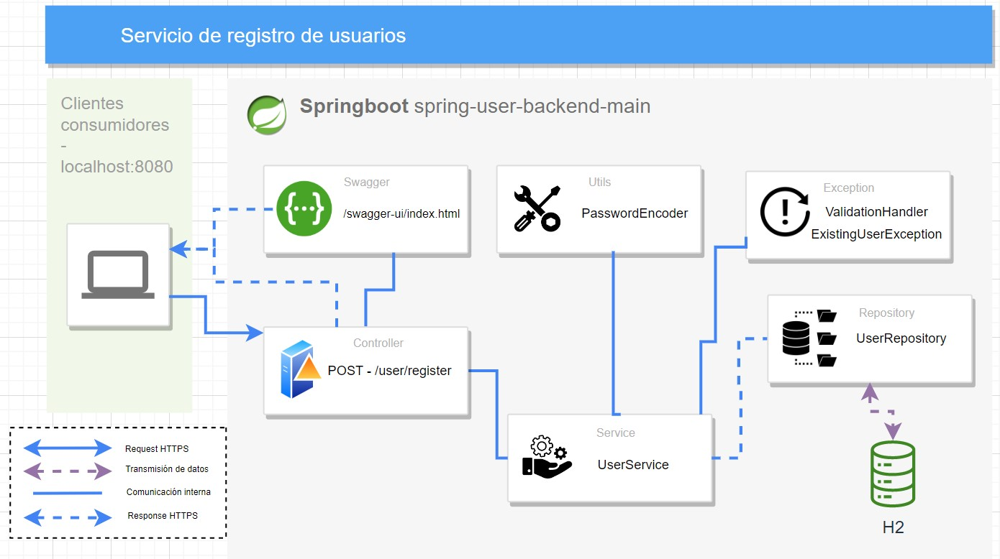

# Proyecto de Registro de Usuarios con Spring Boot

Este es un proyecto desarrollado en Java utilizando Spring Boot para crear un servicio de registro de usuarios. El servicio permite a los usuarios registrarse proporcionando su nombre, correo electrónico, contraseña y detalles de teléfono. Se genera un token JWT para cada usuario registrado y este se almacena en base de datos, junto a los demás datos del usuario.

## Características principales

- Registro de nuevos usuarios con validación de campos.
- Generación de id único con la librería UUID.
- Generación de token JWT para cada usuario registrado.
- Manejo de errores y excepciones durante el registro.
- Persistencia de datos utilizando una base de datos H2.
- Documentación con Swagger para facilitar el uso del servicio.
- Pruebas unitarias para verificar el funcionamiento del servicio.

## Tecnologías utilizadas

- Java
- Maven
- Spring Boot
- H2 Database
- Swagger
- JUnit
- Hibernate

## Instalación

1. Clona el repositorio en tu máquina local:

    ```bash
    git clone https://github.com/dvidHen/spring-user-backend-main.git
    ```

2. Importa el proyecto en tu IDE de Java preferido (por ejemplo, IntelliJ IDEA, Eclipse).

3. Ejecuta una limpieza y actualización del proyecto con Maven:

    ```bash
    mvn clean install
    ```

4. Actualizar el archivo application.properties en la ruta

   ```bash
   src/main/resources
   ```
   
5. Ejecuta el proyecto desde tu IDE o utilizando Maven:

    ```bash
    mvn spring-boot:run
    ```


## Uso

Una vez que el servicio esté en funcionamiento, puedes acceder a la documentación de la API utilizando Swagger:

   ```bash
   http://localhost:8080/swagger-ui.html
   ```

Desde la documentación en Swagger se puede visualizar la estructura general de las clases y desde el mismo se puede probar el funcionamiento del endpoint.


## Estructura de base de datos

La estructura y carga de base de datos se realizó desde las funciones directas de Springboot, donde se estructuraron las tablas y las relaciones correspondientes desde las entities creadas (UserCustomer  y Phones). Sin embargo, se realizó la estracción desde la base de datos y el script se guardó en el archivo: 

   ```
   bbdd-script.text
   ```

## Diagrama de Solución



_Este proyecto fue desarrollado por_ [_Henrry Ramirez_](https://github.com/dvidHen).

